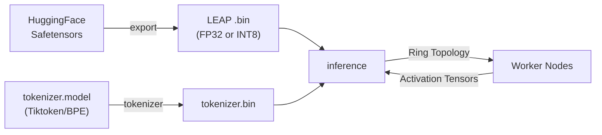
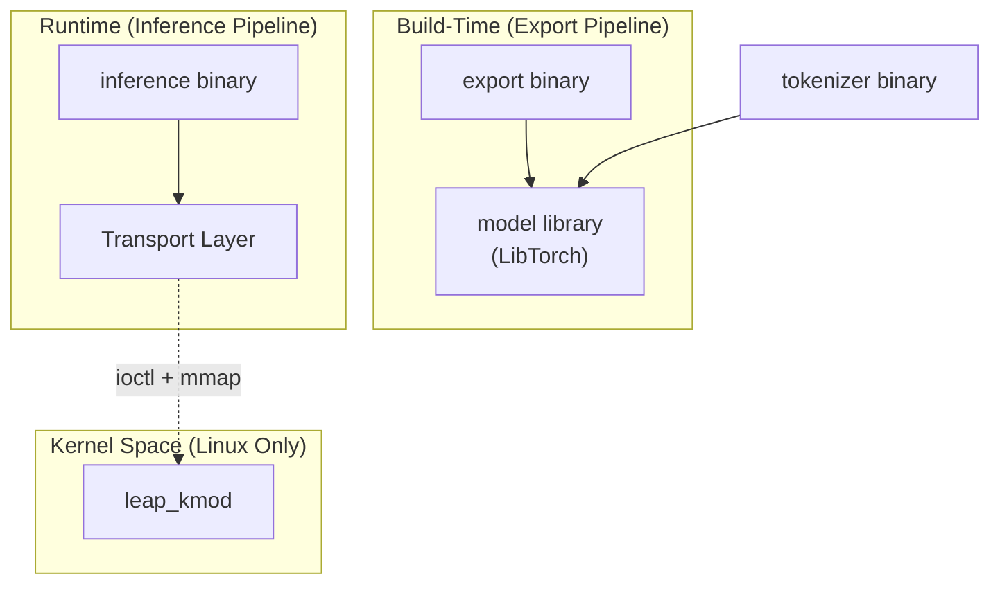
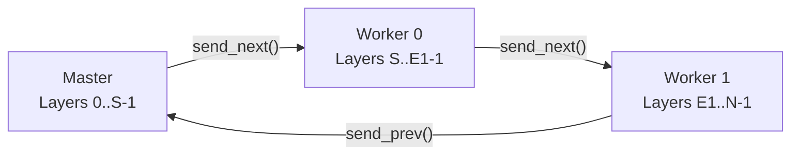

# Architecture Overview

LEAP is structured as a multi-binary C++20 project built around a single CMake configuration. The system compiles into **three executables** (`export`, `tokenizer`, `inference`) and **one static library** (`model`), with an optional Linux kernel module (`leap_kmod`).

## High-Level Data Flow

The end-to-end pipeline follows four stages:



1. **Export** — Loads PyTorch/Safetensors weights via LibTorch, optionally quantizes to INT8, and writes a LEAP binary file.
2. **Tokenize** — Converts a Tiktoken BPE model into a compact binary vocabulary file.
3. **Inference** — Loads the binary model via `mmap`, runs the transformer forward pass with SIMD-optimized kernels, and optionally distributes layers across a ring of networked nodes.

---

## Source Layout

```
src/
├── export/          # Model conversion & quantization (7 files)
│   ├── Loader.cpp   # Safetensors → LibTorch tensor loading
│   ├── Export.cpp    # FP32/INT8 binary serialization
│   └── main.cpp     # CLI entry point
│
├── model/           # LibTorch-based model definitions (13 files)
│   ├── Transformer   # Full Llama architecture (training-capable)
│   ├── Attention      # Multi-Head / Grouped Query Attention + KV Cache
│   ├── FeedForward    # SwiGLU FFN
│   └── RMSNorm        # Root Mean Square Layer Normalization
│
├── inference/       # High-performance inference runtime (20 files)
│   ├── FloatTransformer    # FP32 forward pass with SIMD
│   ├── QuantizedTransformer # W8A8 INT8 forward pass with SIMD
│   ├── TransformerFactory  # Model loading via mmap + version dispatch
│   ├── Tokenizer           # Pure C++ BPE encoder/decoder
│   ├── Sampler             # Temperature/Top-P/Argmax sampling
│   ├── TcpTransport        # TCP transport (ring topology)
│   ├── UdpTransport        # UDP transport (chunked datagrams)
│   ├── KernelTransport     # Zero-copy kernel module transport
│   ├── Transport.h         # Abstract base + control message protocol
│   └── main.cpp            # CLI + chat/generate loops
│
├── kernel/          # Linux kernel module (3 files)
│   ├── leap_module.c    # Netfilter hook, mmap, ioctl handlers
│   ├── leap_protocol.h  # Shared protocol constants (kernel/userspace)
│   └── Makefile
│
└── tokenizer/       # Tokenizer export tool (3 files)
    ├── Tokenizer.cpp  # Tiktoken wrapper + binary export
    └── main.cpp       # CLI entry point
```

---

## Component Relationships



| Component | Depends On | Output |
|-----------|-----------|--------|
| `model` (lib) | LibTorch | Static library |
| `export` | `model`, LibTorch, nlohmann_json, safetensors-cpp, CLI11 | `model.bin` |
| `tokenizer` | LibTorch, tiktoken-cpp, CLI11 | `tokenizer.bin` |
| `inference` | CLI11, OpenMP | Text generation |
| `leap_kmod` | Linux kernel headers | `leap_transport.ko` |

> **Key Design Decision:** The `inference` binary has **zero dependency** on LibTorch or Python. It operates entirely on raw memory-mapped binary files, using hand-written SIMD kernels. This makes it deployable on any machine with a C++20 compiler and OpenMP.

---

## Distributed Ring Topology

In distributed mode, LEAP splits model layers across nodes connected in a **unidirectional ring**:



Each forward pass sends the activation tensor (`dim × float32`) through the ring. The **master** node handles tokenization, sampling, and the generation loop. **Workers** run in a blocking `worker_loop()`, receiving activations, computing their assigned layers, and forwarding the result.

### Control Plane

Layer assignments can be changed at runtime via `/resize` commands. The master sends a `ControlMessage` (padded to full packet size) through the ring, and waits for an `ACK` to propagate back from the tail worker. After resizing, the KV cache is cleared and conversation state is reset.

---

## Precision Modes

| Mode | File Version | Memory per Param | SIMD Kernels | Use Case |
|------|-------------|-----------------|-------------|----------|
| FP32 | v1 | 4 bytes | AVX2 / NEON | Maximum accuracy |
| INT8 (W8A8) | v2 | ~1.25 bytes | `vdotq_s32` (NEON), `_mm256_madd_epi16` (AVX2) | 4× memory reduction, higher throughput |

The `TransformerFactory` reads the binary header to auto-detect precision and instantiate the correct class (`FloatTransformer` or `QuantizedTransformer`).

---

## Further Reading

| Document | Description |
|----------|-------------|
| [Exporter](exporter.md) | Model conversion pipeline and binary formats |
| [Inference Engine](inference-engine.md) | SIMD kernels, forward pass, and distributed execution |
| [Transport Layer](transport.md) | TCP, UDP, and Kernel transport implementations |
| [Kernel Module](kernel-module.md) | Zero-copy Linux kernel module internals |
| [Model Library](model-library.md) | LibTorch-based Llama architecture |
| [Tokenizer](tokenizer.md) | BPE tokenizer export and inference |
| [Build System](build-system.md) | CMake configuration and dependencies |
