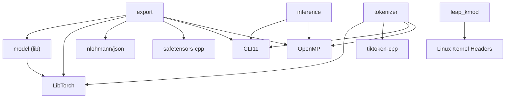

# Build System (`CMakeLists.txt`)

LEAP uses **CMake 4.1+** with C++20, targeting multi-platform builds (Linux, macOS, potentially Windows). The build produces three executables, one static library, and an optional Linux kernel module.

## Build Targets

| Target | Type | Description |
|--------|------|-------------|
| `export` | Executable | Model conversion & quantization tool |
| `inference` | Executable | High-performance inference runtime |
| `tokenizer` | Executable | Tokenizer model exporter |
| `model` | Static Library | LibTorch-based Llama model definitions |
| `leap_kmod` | Kernel Module | Zero-copy networking (Linux only, optional) |

---

## Dependencies

| Dependency | Version | Targets | Source |
|-----------|---------|---------|--------|
| **LibTorch** | 2.4+ | `export`, `model`, `tokenizer` | Manual download or pip |
| **nlohmann/json** | 3.12+ | `export` | FetchContent (auto-downloaded) |
| **safetensors-cpp** | latest | `export` | FetchContent (Git) |
| **CLI11** | 2.6.1 | `export`, `inference`, `tokenizer` | FetchContent (Git) |
| **tokenizers (tiktoken-cpp)** | — | `tokenizer` | Git submodule (`third-party/tokenizers`) |
| **OpenMP** | — | All targets | System (Linux) or Homebrew (macOS) |

### LibTorch

The most significant dependency. Required for the export pipeline but **not** for inference.

**Option A: Direct Download (x86\_64)**
```bash
wget https://download.pytorch.org/libtorch/cpu/libtorch-cxx11-abi-shared-with-deps-2.4.0%2Bcpu.zip
unzip libtorch-*.zip -d third-party/
```

**Option B: Via Python pip**
```bash
pip install torch --index-url https://download.pytorch.org/whl/cpu
TORCH_PATH=$(python3 -c 'import torch; print(torch.utils.cmake_prefix_path)')
cmake -DCMAKE_PREFIX_PATH=$TORCH_PATH ...
```

> **Note:** Option B is recommended for ARM platforms (Raspberry Pi, Jetson) where pre-built LibTorch binaries aren't available.

---

## Compiler Flags

### Release Optimization Flags

| Platform | Flags |
|----------|-------|
| GCC/Clang | `-O3 -march=native -mtune=native -ffast-math -funroll-loops -fomit-frame-pointer` |
| MSVC | `/O2 /arch:AVX2 /fp:fast` |

Key flags:
- **`-march=native`**: Enables all SIMD instructions supported by the build machine (AVX2, NEON, etc.).
- **`-ffast-math`**: Allows aggressive FP optimizations (breaks strict IEEE compliance — acceptable for inference workloads).
- **`-funroll-loops`**: Aggressive loop unrolling for better pipeline utilization.

### Link-Time Optimization (LTO)

LTO/IPO is automatically detected and enabled for Release builds via `check_ipo_supported()`. This allows cross-translation-unit inlining and dead code elimination.

### Exception Handling

LibTorch's default build flags disable exceptions (`-fno-exceptions`). LEAP's CMake configuration explicitly strips these flags and forces:
```
-fexceptions -frtti -fvisibility=default
```

This ensures C++ exception handling works correctly throughout all targets.

---

## OpenMP Configuration

### Linux
Standard `find_package(OpenMP)` — links `OpenMP::OpenMP_CXX`.

### macOS (Homebrew)
macOS requires special handling because Apple Clang doesn't ship OpenMP:
1. Detects Homebrew's `libomp` prefix via `brew --prefix libomp`.
2. Falls back to hardcoded paths (`/opt/homebrew/opt/libomp` or `/usr/local/opt/libomp`).
3. Adds compile flags: `-Xpreprocessor -fopenmp`.
4. Links the `omp` library directly.

```bash
# Required on macOS
brew install libomp
```

---

## Kernel Module Build

Enabled via the `BUILD_KERNEL_MODULE` CMake option (Linux only):

```bash
cmake -DBUILD_KERNEL_MODULE=ON ...
```

This creates a custom target that invokes the kernel's build system:
```cmake
add_custom_target(leap_kmod ALL
    COMMAND make -C ${CMAKE_CURRENT_SOURCE_DIR}/src/kernel
)
```

**Requirements:**
- Linux kernel headers: `sudo apt install linux-headers-$(uname -r)`

---

## Build Instructions

### Quick Start

```bash
# Clone with submodules
git clone --recursive https://github.com/Harikeshav-R/LEAP.git
cd LEAP

# Configure (choose one LibTorch method)
cmake -S . -B build -DCMAKE_BUILD_TYPE=Release \
    -DCMAKE_PREFIX_PATH=$(pwd)/third-party/libtorch

# Build all targets
cmake --build build --config Release -- -j$(nproc)
```

### Build with Kernel Module (Linux)

```bash
cmake -S . -B build -DCMAKE_BUILD_TYPE=Release \
    -DBUILD_KERNEL_MODULE=ON \
    -DCMAKE_PREFIX_PATH=$(pwd)/third-party/libtorch

cmake --build build --config Release -- -j$(nproc)
```

### macOS

```bash
brew install libomp cmake

# Using pip-installed PyTorch
pip install torch --index-url https://download.pytorch.org/whl/cpu
TORCH_PATH=$(python3 -c 'import torch; print(torch.utils.cmake_prefix_path)')

cmake -S . -B build -DCMAKE_BUILD_TYPE=Release \
    -DCMAKE_PREFIX_PATH=$TORCH_PATH

cmake --build build --config Release -- -j$(sysctl -n hw.ncpu)
```

---

## Dependency Graph



---

## Troubleshooting

### LibTorch ABI Mismatch
**Symptom:** Linker errors with `std::__cxx11::basic_string`
**Fix:** Use the **cxx11 ABI** version of LibTorch. If using pip, ensure GCC versions match.

### Kernel Module Load Failure
**Symptom:** `Operation not permitted` on `insmod`
**Fix:** Disable Secure Boot or sign the module.

**Symptom:** `Exec format error`
**Fix:** Module compiled for a different kernel. Rebuild after `sudo apt install linux-headers-$(uname -r)`.

### OpenMP Not Found (macOS)
**Symptom:** CMake error about libomp
**Fix:** `brew install libomp`
