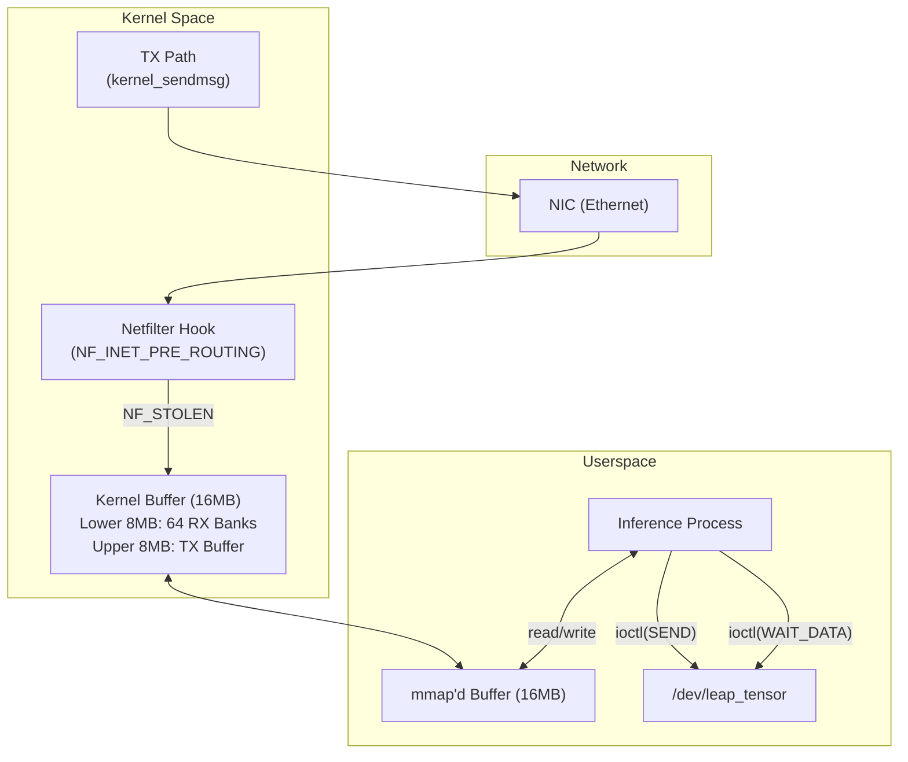

# Kernel Module (`src/kernel/`)

The LEAP Kernel Module (`leap_kmod`) is a Linux loadable kernel module that implements **zero-copy, kernel-bypass networking** specifically tailored for tensor transmission over Ethernet. By intercepting packets at the Netfilter layer before the standard network stack processes them, it dramatically reduces latency and eliminates unnecessary memory copies.

## Source Files

| File | Purpose |
|------|---------|
| `leap_module.c` | Core kernel module — Netfilter hook, ioctl handlers, mmap, TX/RX logic |
| `leap_protocol.h` | Shared protocol definitions (constants, headers, IOCTLs) — used by both kernel and userspace |
| `Makefile` | Kernel build system integration |

---

## Architecture



---

## Buffer Layout

The module allocates a contiguous 16 MB buffer, split into two regions:

```
Offset 0x000000 ┌─────────────────────────────────────────────┐
                │               RX Buffer (8 MB)              │
                │  Bank 0  (128 KB)  [offset 0x000000]        │
                │  Bank 1  (128 KB)  [offset 0x020000]        │
                │  Bank 2  (128 KB)  [offset 0x040000]        │
                │  ...                                        │
                │  Bank 63 (128 KB)  [offset 0x7E0000]        │
Offset 0x800000 ├─────────────────────────────────────────────┤
                │               TX Buffer (8 MB)              │
                │  Contiguous staging area for outgoing data  │
Offset 0xFFFFFF └─────────────────────────────────────────────┘
```

| Parameter | Value |
|-----------|-------|
| `LEAP_BUFFER_SIZE` | 8 MB per region (16 MB total) |
| `LEAP_RX_BANKS` | 64 |
| `LEAP_RX_BANK_SIZE` | 128 KB per bank |
| `LEAP_CHUNK_SIZE` | 1400 bytes per UDP chunk |

Each RX bank can hold a complete tensor activation (e.g., 4096 floats = 16 KB, well within 128 KB).

---

## Receive Path (Zero-Copy RX)

### 1. Netfilter Interception — `leap_nf_hook()`

The module registers a Netfilter hook at `NF_INET_PRE_ROUTING` with **highest priority** (`NF_IP_PRI_FIRST`):

```c
static struct nf_hook_ops nfho = {
    .hook     = leap_nf_hook,
    .pf       = PF_INET,
    .hooknum  = NF_INET_PRE_ROUTING,
    .priority = NF_IP_PRI_FIRST,
};
```

### 2. Packet Filtering

Every incoming UDP packet is inspected:
1. Check if it's UDP and matches the configured `listening_port`.
2. Extract the LEAP header from the payload.
3. Verify `magic == LEAP_MAGIC` (`0x4C454150`).

Non-LEAP packets are passed through unchanged (`NF_ACCEPT`). LEAP packets are stolen from the network stack (`NF_STOLEN`).

### 3. Bank Selection & Direct Copy

```c
bank_idx = ntohs(hdr->seq_id) % LEAP_RX_BANKS;  // Map seq_id → bank
chunk_id = ntohs(hdr->chunk_id);
offset   = bank_idx * LEAP_RX_BANK_SIZE + chunk_id * LEAP_CHUNK_SIZE;

// Direct copy from skb to mmap'd RAM
memcpy(rx_buffer + offset, payload, payload_len);
```

### 4. Chunk Tracking

Each bank maintains:
- **Expected chunks count** (`total_chunks`) from the header.
- **Received chunks counter** (atomic increment).
- **Source metadata** — sender IP and port cached in `bank_metadata_cache`.

### 5. Completion Notification

When all chunks for a bank are received:
```c
set_bit(bank_idx, data_ready_map);
wake_up_interruptible(&leap_wait_queue);
```

The userspace process sleeping in `ioctl(LEAP_IOCTL_WAIT_DATA)` is woken up and returns the completed `bank_idx`.

### 6. Hybrid Polling

To minimize latency, the module uses a **hybrid busy-wait + sleep** strategy:
1. **Busy-wait** for `busy_wait_limit` iterations (configurable module parameter, default: 5000).
2. If no data arrives, fall back to `wait_event_interruptible()` on the wait queue.

This avoids the overhead of immediate context switches for high-frequency activations while still being CPU-friendly during idle periods.

---

## Transmit Path (Zero-Copy TX)

### Userspace Side

1. Write header + tensor data into the TX buffer (upper 8 MB of mmap'd region).
2. Call `ioctl(LEAP_IOCTL_SEND, &size)`.

### Kernel Side — `leap_dev_ioctl(LEAP_IOCTL_SEND)`

1. Calculate total chunks: `total_chunks = ceil(size / LEAP_CHUNK_SIZE)`.
2. For each chunk:
   - Construct a `leap_header` with magic, seq\_id, chunk\_id, total\_chunks.
   - Call `send_udp_chunk()` which uses `kernel_sendmsg()` with a `kvec` pointing directly to the TX buffer.
3. The NIC DMA reads directly from the application's memory view — **true zero-copy**.

### `send_udp_chunk()`

Constructs a raw UDP/IP socket and sends one chunk:
```c
struct kvec iov[2] = {
    { .iov_base = &header, .iov_len = sizeof(header) },
    { .iov_base = data,    .iov_len = len }
};
kernel_sendmsg(leap_socket, &msg, iov, 2, total_len);
```

---

## IOCTL Interface

| IOCTL | Direction | Argument | Description |
|-------|-----------|----------|-------------|
| `LEAP_IOCTL_WAIT_DATA` | Out | — | Block until an RX bank is complete. Returns `bank_idx`. |
| `LEAP_IOCTL_SEND` | In | `unsigned int` (size) | Transmit `size` bytes from TX buffer. |
| `LEAP_IOCTL_SET_DEST` | In | `unsigned int` (IPv4) | Set destination IP for outgoing packets. |
| `LEAP_IOCTL_SET_PORT` | In | `unsigned short` | Set local listening port. |
| `LEAP_IOCTL_SET_TX_PORT` | In | `unsigned short` | Set destination port for TX. |
| `LEAP_IOCTL_GET_BANK_SRC` | In/Out | `leap_bank_metadata` | Get source IP/port for a completed bank. |

---

## Memory Mapping — `leap_dev_mmap()`

Maps the 16 MB kernel buffer (RX + TX) into the userspace process's address space:

```c
remap_pfn_range(vma,
    vma->vm_start,
    virt_to_phys(leap_buffer) >> PAGE_SHIFT,
    size,
    vma->vm_page_prot);
```

The buffer is allocated with `vzalloc()` for large contiguous allocation and backed by `vmalloc_to_pfn()` for per-page mapping.

---

## Synchronization

| Resource | Mechanism |
|----------|-----------|
| Per-bank chunk tracking | `spinlock_t rx_locks[64]` — Fine-grained per-bank spinlocks |
| Bank completion | `DECLARE_BITMAP(data_ready_map, 64)` — Atomic bitset |
| Userspace wakeup | `DECLARE_WAIT_QUEUE_HEAD(leap_wait_queue)` |
| Device open count | `atomic_t open_count` |

---

## Module Parameters

| Parameter | Default | Description |
|-----------|---------|-------------|
| `busy_wait_limit` | 5000 | Iterations to busy-wait before sleeping on wait queue |

Tunable at load time or runtime:
```bash
# At load time
insmod leap_transport.ko busy_wait_limit=10000

# At runtime
echo 10000 > /sys/module/leap_transport/parameters/busy_wait_limit
```

---

## Installation

```bash
# Build
cd src/kernel && make
# OR via CMake:
cmake -S . -B build -DBUILD_KERNEL_MODULE=ON && cmake --build build

# Load
sudo insmod leap_transport.ko

# Verify
ls -la /dev/leap_tensor
dmesg | tail

# Unload
sudo rmmod leap_transport
```

**Requirements:**
- Linux kernel headers: `sudo apt install linux-headers-$(uname -r)`
- Secure Boot may need to be disabled, or the module must be signed.
