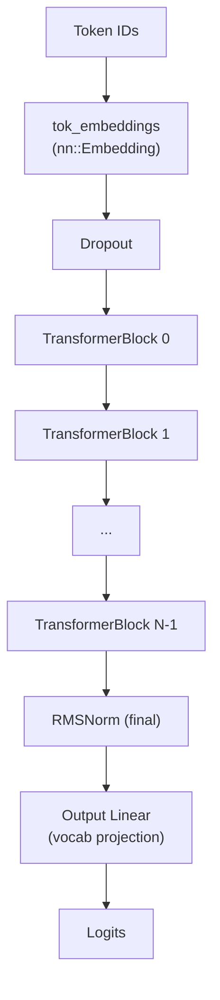
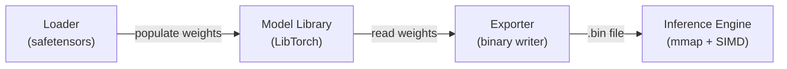

# Model Library (`src/model/`)

The model library is a **LibTorch-based** (C++ PyTorch) implementation of the Llama transformer architecture. It is used exclusively by the **export tool** to load, validate, and serialize model weights. The inference engine does *not* use this library — it has its own optimized reimplementation.

## Source Files

| File | Purpose |
|------|---------|
| `ModelArgs.h` | Hyperparameters struct (dim, n\_layers, n\_heads, etc.) |
| `Transformer.h/cpp` | Full transformer: embedding → layers → norm → output |
| `TransformerBlock.h/cpp` | Single decoder block: attention + FFN + residual |
| `Attention.h/cpp` | Multi-Head / Grouped Query Attention with KV cache |
| `FeedForward.h/cpp` | SwiGLU feed-forward network |
| `RMSNorm.h/cpp` | Root Mean Square Layer Normalization |
| `Utils.h/cpp` | RoPE frequency computation + rotary embedding application |

---

## ModelArgs

```cpp
struct ModelArgs {
    int64_t dim         = 4096;       // Transformer width
    int64_t n_layers    = 32;         // Number of decoder layers
    int64_t n_heads     = 32;         // Number of query heads
    optional<int64_t> n_kv_heads;     // KV heads (for GQA; nullopt = same as n_heads)
    int64_t vocab_size  = 32000;      // Vocabulary size
    optional<int64_t> hidden_dim;     // FFN hidden dim (auto-computed if not set)
    int64_t multiple_of = 256;        // FFN dim rounding factor
    double  norm_eps    = 1e-5;       // RMSNorm epsilon
    int64_t max_seq_len = 2048;       // Maximum sequence length
    double  dropout     = 0.0;        // Dropout rate
};
```

---

## Transformer (`TransformerImpl`)

The top-level module composes all sub-modules:



### Constructor

1. Creates `tok_embeddings` — `nn::Embedding(vocab_size, dim)`.
2. Creates `n_layers` `TransformerBlock` instances.
3. Creates final `RMSNorm` and `output` linear projection.
4. Precomputes RoPE frequency tensor (`freqs_cis`).
5. Initializes all weights via `_init_weights()` (Xavier uniform for linear layers, normal for embeddings).

### `forward()`

1. Embeds token IDs → `[B, S, dim]`.
2. Applies dropout.
3. Iterates through all `TransformerBlock` layers (with KV cache support).
4. Applies final RMSNorm.
5. Projects to vocabulary logits via `output` linear layer.
6. Optionally computes cross-entropy loss if `targets` are provided.

### `generate()`

Autoregressive generation loop:
1. Initializes KV caches for each layer.
2. For each step:
   - Forward pass with KV cache.
   - Apply temperature scaling.
   - Optional top-k filtering.
   - Sample from softmax distribution.
   - Append generated token.

### `configure_optimizers()`

Creates an AdamW optimizer with weight decay applied only to 2D+ parameter tensors (weight matrices), not biases or normalization parameters.

### `estimate_mfu()`

Estimates model FLOPs utilization (MFU) relative to hardware peak performance (A100 at BF16).

---

## TransformerBlock

A single decoder layer with pre-norm residual connections:

```
x = x + Attention(RMSNorm(x))
x = x + FeedForward(RMSNorm(x))
```

Composed of:
- `attention_norm` — RMSNorm before attention
- `attention` — Multi-Head Attention
- `ffn_norm` — RMSNorm before FFN
- `feed_forward` — SwiGLU FFN

---

## Attention (`AttentionImpl`)

Implements Multi-Head Attention with **Grouped Query Attention (GQA)** and **KV Caching**.

### Projections
- `wq` — Query: `[dim → n_heads × head_dim]`
- `wk` — Key: `[dim → n_kv_heads × head_dim]`
- `wv` — Value: `[dim → n_kv_heads × head_dim]`
- `wo` — Output: `[n_heads × head_dim → dim]`

### GQA Implementation

When `n_kv_heads < n_heads` (e.g., Llama 3 uses 8 KV heads for 32 query heads):
1. Reshape Q to `[B, n_kv_heads, n_rep, S, D]`.
2. Reshape K/V to `[B, n_kv_heads, 1, S, D]`.
3. PyTorch's SDPA broadcasts the singleton dimension automatically.

This achieves **zero-copy broadcasting** — no explicit key/value repetition.

### KV Cache

- Cache tensors: `[B, n_kv_heads, max_seq_len, head_dim]`.
- In-place update via `.slice().copy_()`.
- During decoding (seqlen=1), attends to all cached positions.
- During prefill (seqlen>1), uses causal mask.

### Scaled Dot-Product Attention

Uses PyTorch's `at::scaled_dot_product_attention()`, which selects the best backend (Flash Attention, Memory-Efficient, or Math) automatically.

---

## FeedForward (`FeedForwardImpl`)

Implements the **SwiGLU** variant of the feed-forward network:

```
FFN(x) = W2(SiLU(W1(x)) ⊙ W3(x))
```

### Hidden Dimension Computation

If `hidden_dim` is not explicitly provided:
```
hidden_dim = 4 × dim
hidden_dim = ⌊(2/3 × hidden_dim)⌋
hidden_dim = multiple_of × ⌈hidden_dim / multiple_of⌉
```

This matches Meta's Llama implementation for efficient hardware utilization.

### Layers
- `w1` (Gate): `[dim → hidden_dim]`
- `w3` (Up): `[dim → hidden_dim]`
- `w2` (Down): `[hidden_dim → dim]`

---

## RMSNorm (`RMSNormImpl`)

Root Mean Square Layer Normalization:

$$\text{RMSNorm}(x) = \frac{x}{\sqrt{\frac{1}{n}\sum x_i^2 + \epsilon}} \cdot w$$

- Avoids the mean subtraction of LayerNorm, reducing computation.
- Learned scale parameter `weight` of size `dim`.
- Uses `eps` for numerical stability (default: `1e-5`).

---

## Utils (`Utils.h/cpp`)

### `precompute_freqs_cis()`

Computes the complex-valued RoPE frequency tensor:
1. Compute base frequencies: `θ_i = 10000^{-2i/dim}`.
2. Create position indices: `t = [0, 1, ..., max_seq_len-1]`.
3. Outer product: `freqs = t × θ`.
4. Convert to complex: `freqs_cis = polar(1.0, freqs)`.

Returns `[max_seq_len, dim/2]` complex tensor.

### `apply_rotary_emb()`

Applies precomputed rotary embeddings to query and key tensors:
1. View Q/K as complex numbers: `[B, S, n_heads, dim/2]` complex.
2. Multiply by `freqs_cis` (element-wise complex multiplication).
3. Convert back to real: `[B, S, n_heads, dim]` float.

---

## Relationship to Other Components



- The **Loader** creates a `Model::Transformer` instance and populates its weights.
- The **Exporter** reads the weights from the model and serializes them.
- The **Inference Engine** reads the binary file directly — it never uses `Model::Transformer`.

> **Design Note:** Keeping the model library separate from inference allows the export tool to leverage LibTorch's tensor operations for weight manipulation (permutation, quantization) while the inference engine remains dependency-free.
